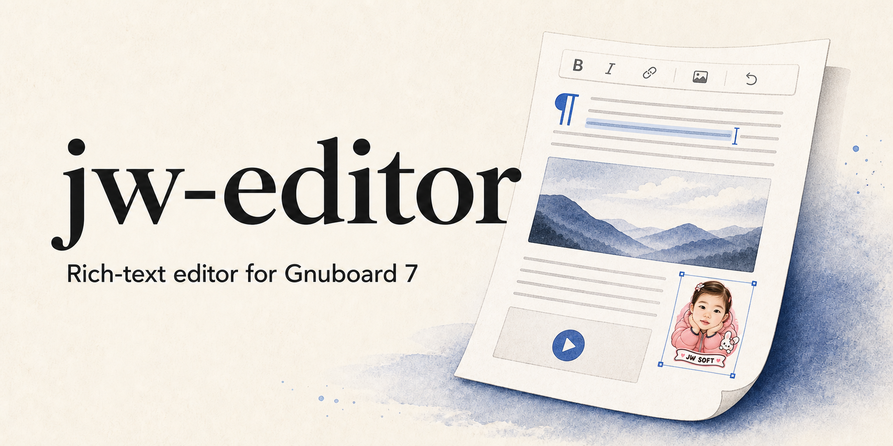

# jw-editor



그누보드7에서 글과 이미지·동영상·SNS 게시물을 함께 작성하는 리치 텍스트 에디터 플러그인입니다. G7 코어 수정 없이 설치하며, 작성 화면과 글보기 화면에 같은 미디어 표시 정책을 적용합니다.

> 현재 공개 배포본은 [Releases](https://github.com/jiwonpapa/jwsoft-tiptap-editor/releases)에서 확인하세요. `main`의 0.1.1은 정식 출시 검증 중이며, 버전 표기나 ZIP 생성만으로 안정판 승인을 뜻하지 않습니다.

## 무엇을 할 수 있나요?

- **글 편집** — 제목, 굵게·기울임·밑줄, 글자색·강조색, 정렬, 목록·체크리스트, 링크, 표, 찾기·바꾸기, 전체화면.
- **이미지** — 파일 선택·드래그 앤 드롭·붙여넣기 업로드, 업로드 상태·실패 재시도, 정렬·크기·대체 텍스트·캡션.
- **동영상** — MP4 청크 업로드와 재개, 원본 파일명·확장자 보존, 실제 영상 비율에 맞춘 반응형 플레이어. YouTube·Vimeo 지원 URL 삽입.
- **SNS와 링크** — X·Facebook 화이트리스트 게시물 공식 표시, 다른 지원 URL은 링크 카드. 비공개·삭제 게시물이나 제공자 제한 시 원문 링크로 안내합니다.
- **관리자 제어** — 기능별 ON/OFF, 업로드 제한, 외부 콘텐츠 로드 방식, 툴바 구성과 높이, 이미지 관리·정리.
- **사용 환경** — 모바일·다크모드, 한영 UI와 다국어 본문, 하단 버전·글자 수·도움말, 읽기 전용 HTML 보기·복사.

단순 글·사진 작성만 필요하다면 기존 에디터를 반드시 바꿀 이유는 없습니다. 이미지·영상·SNS 작업과 기능별 운영 설정이 필요한 사이트를 위한 대안입니다.

## 설치

### GitHub 주소로 설치 — 권장

그누보드7 **관리자 → 플러그인 → 플러그인 설치 → GitHub에서 설치**에서 다음 주소를 입력합니다.

```text
https://github.com/jiwonpapa/jwsoft-tiptap-editor
```

1. 설치 결과와 릴리스 버전을 확인합니다.
2. CKEditor 등 다른 에디터가 활성화되어 있으면 관리자 플러그인 목록에서 먼저 비활성화합니다. 두 에디터를 동시에 활성화하지 마세요.
3. **jw-editor**를 활성화하고 설정에서 필요한 기능을 켭니다.
4. 테스트 글을 작성하고 **저장 → 조회 → 다시 수정**까지 확인합니다.

표시 이름은 `jw-editor`이며 업데이트 호환용 플러그인 ID와 저장소 주소는 `jwsoft-tiptap-editor`를 유지합니다. 별도 npm 빌드나 Tiptap Pro 결제는 설치에 필요하지 않습니다.

### ZIP으로 설치·업데이트

[GitHub Releases](https://github.com/jiwonpapa/jwsoft-tiptap-editor/releases)에서 `jwsoft-tiptap-editor-<version>.zip`을 내려받아 G7 플러그인 설치 화면에 업로드합니다. 업데이트도 G7의 공식 플러그인 업데이트 기능을 사용합니다. 상세 절차는 [설치 안내](docs/06-installation.md)를 참고하세요.

### 기존 글과 에디터 전환

**설치·활성화·조회만으로 기존 글의 저장된 본문은 바뀌지 않습니다.** 기존 글을 jw-editor에서 **수정 후 저장**할 때 지원하지 않는 inline style·전용 class·HTML 구조가 달라질 수 있습니다. 해당 글의 편집 화면에서 경고를 확인한 뒤 진행하거나 읽기 전용으로 유지하세요.

자동 마이그레이션이나 CKEditor의 모든 HTML 서식 보존은 지원하지 않습니다. 전환에 문제가 있으면 저장하지 말고 jw-editor를 비활성화한 뒤 기존 에디터를 다시 활성화하세요.

## 기본 사용법

- 글자를 선택하고 툴바 또는 선택 도구에서 서식을 지정합니다.
- 이미지·동영상 도구를 열어 파일을 선택하고 업로드 상태를 확인한 뒤 삽입합니다.
- 빈 줄에 지원 URL을 붙여넣거나 입력 후 Enter를 누르면 설정에 따라 플레이어 또는 카드로 변환합니다.
- 하단 왼쪽 `?`에서 짧은 도움말과 **HTML 소스 보기·복사**를 엽니다. 소스는 읽기 전용이며 저장된 원본과 다를 수 있습니다.
- 에디터 입력만으로 글이 저장되지는 않습니다. 게시판·상품·페이지의 저장 버튼을 사용하세요.

## 지원 범위와 제한

- 그누보드7 `>=7.0.9` 연동: 공개/관리자 게시판, 상품 설명, 페이지 본문. G7를 수정하지 않는 독립 플러그인입니다.
- 저장 정본은 서버가 정제한 HTML입니다. 임의 style/class/script/iframe을 저장하는 HTML 코드 편집기는 아닙니다.
- 설정에서 끈 삽입 기능의 기존 문서는 보존합니다. 외부 제공자의 로그인·공개 범위·지역·광고차단·네트워크 제한은 별도로 적용됩니다.
- 에디터 라이브러리는 패키지에 포함합니다. X·Facebook 공식 게시물 SDK는 사용자 승인된 화이트리스트 예외이며 설정에 따라 외부 연결합니다.
- Office/Google Docs 변환, 공동 편집, AI 작성, 페이지 빌더와 임의 외부 모듈 설치는 포함하지 않습니다.
- 실제 UI와 검증 결과는 별도입니다. 상단 이미지는 소개용 일러스트입니다.

## 개발과 기능 확장

TypeScript + Tiptap/ProseMirror 편집 엔진, PHP 플러그인·서버 검증으로 구성합니다. 내부 확장은 **기본 편집 / 이미지 / 표 / 미디어 / SNS** 모듈로 조립합니다. 업로드·미디어 표시·G7 연결·정책 검증은 분리되어 있으며, 개발자가 소스에서 확장한 뒤 하나의 검증된 패키지로 배포합니다.

공개 동적 모듈 로더나 외부 모듈 마켓은 아직 제공하지 않습니다. 새 저장 요소는 프런트엔드 확장만 추가해서는 안 되며 서버 정책·조회 렌더러·회귀 테스트를 함께 맞춰야 합니다. [확장 가이드](docs/12-extension-guide.md)

```bash
cp .env.example .env
npm ci
composer install
make doctor
make check
make build
make integration-check
```

`G7_ROOT`에는 전용 테스트 체크아웃을 지정하세요. 일반 작업 저장소를 테스트 호스트로 사용하지 않습니다. 릴리스는 [테스트](docs/08-testing.md)와 [배포](docs/09-deployment.md)의 단계별 검증을 따릅니다.

## 라이선스

jw-editor는 **[Apache License 2.0](LICENSE)**으로 제공합니다. 라이선스 조건에 따라 사용·수정·재배포할 수 있으며, 재배포 시 라이선스와 해당 저작권·NOTICE 고지를 보존해야 합니다. 보증은 제공하지 않습니다.

Tiptap/ProseMirror 등 제3자 구성요소의 라이선스는 그대로 유지합니다. [NOTICE](NOTICE) · [제3자 라이선스](THIRD_PARTY_NOTICES.md) · [기여 안내](CONTRIBUTING.md)

## 문서·지원

[설치](docs/06-installation.md) · [개발 환경](docs/07-development.md) · [아키텍처](docs/03-architecture.md) · [확장 가이드](docs/12-extension-guide.md) · [보안](SECURITY.md) · [변경 기록](CHANGELOG.md)

문제 제보는 [GitHub Issues](https://github.com/jiwonpapa/jwsoft-tiptap-editor/issues)에 G7 버전, 하단 에디터 버전, 브라우저와 재현 순서를 남겨 주세요. 비밀번호·토큰·개인정보나 보안 취약점의 상세 payload는 공개하지 마세요.
